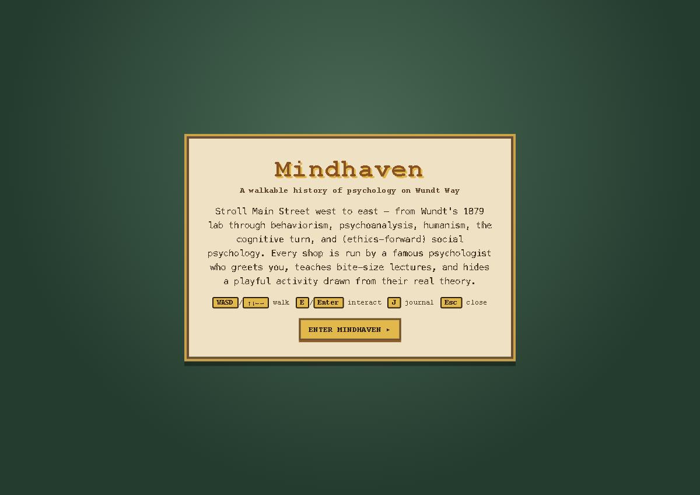
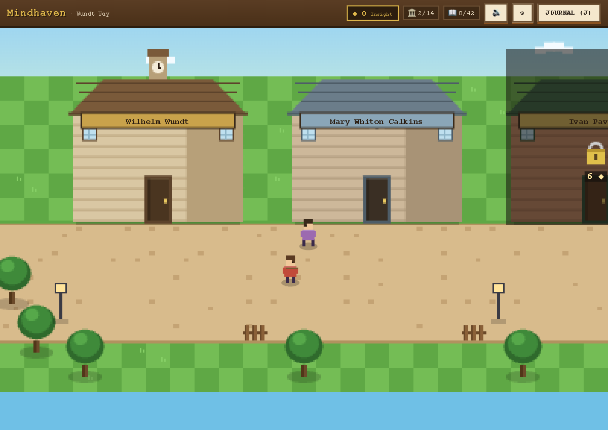
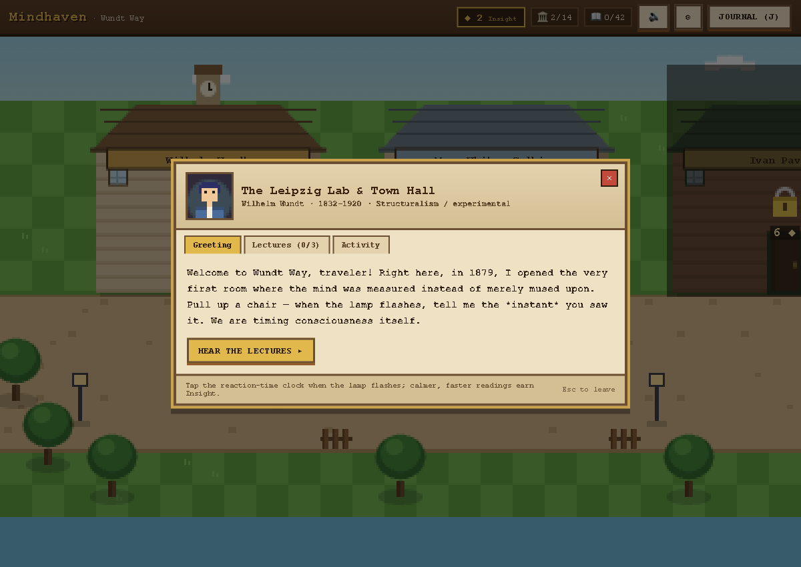

# Mindhaven 🧠🏘️

**▶ Play it now: [mindhaven-game.vercel.app](https://mindhaven-game.vercel.app)** — free, in your browser, desktop or phone.

A cozy, **Stardew Valley–style pixel-art educational game**. Stroll **Wundt
Way**, a single Main Street that is a walkable history of psychology: each of
14 building facades is run by a famous psychologist who greets you in
character, teaches bite-size mini-lectures, and hides an interactive activity
drawn from their real theory. Walking west → east takes you forward in time —
from Wundt's 1879 lab through behaviorism, psychoanalysis, humanism, the
cognitive turn, and (ethics-forward) social psychology.

All pixel art **and sound** are generated procedurally in code (HTML5 canvas +
WebAudio oscillators). No external or copyrighted assets — original work only.

## Screenshots

| Title | Town (Wundt Way) | NPC dialogue |
|-------|------------------|--------------|
|  |  |  |

## Run it

```bash
npm install
npm run dev      # http://localhost:5173
```

Production build (type-checked) / preview:

```bash
npm run build    # tsc -b && vite build — passes clean
npm run preview
npm test         # vitest run — 101 unit tests, all passing
```

Requires Node 22 / npm 10 (developed on those). Stack: **React + TypeScript +
Vite**, plain CSS (no UI framework), **Vitest** (jsdom) + Testing Library for
unit tests.

## Controls

| Input | Action |
|-------|--------|
| `WASD` / `↑ ↓ ← →` | Walk the street |
| `E` / `Enter` / `Space` | Enter a building / interact (when the prompt shows) |
| `J` | Open the Insight Journal |
| `Esc` | Close a panel / back out of a lecture |
| **Touch** | On-screen D-pad + ✦ interact button appear automatically on touch devices |

## Core loop

1. **Walk** Wundt Way; approach a shop → interaction prompt.
2. **Enter** → NPC dialogue panel with the psychologist's portrait, dates,
   school, and an in-character **intro** (typewriter effect). Reading it grants
   **+2 Insight**.
3. **Mini-lectures** (3 per building, 42 total) — a titled topic + a faithful
   2–4 sentence blurb in the NPC's voice. Completing one grants **+3 Insight**.
4. **Activity** tab — an interactive beat tied to the building's theory
   (all 14 playable — see table below). First engagement grants **+4 Insight**.
5. **Insight currency + gating** — later, denser shops are **locked** until you
   bank enough Insight (a cumulative threshold score — unlocking never spends
   it). The Leipzig Lab + Calkins' Reading Room are open from the start; the
   rest unlock progressively (gates ramp 6 → 72 ◆, west → east).
6. **Insight Journal** (`J`) — revisit any unlocked lecture and meet the 5
   wandering townsfolk.
7. **Procedural SFX** (UI blips, chimes, unlock fanfare) with a persisted mute
   toggle in the HUD.
8. **Progress persists** to `localStorage` (`mindhaven.progress.v1`), with
   hardened loading that survives corrupt or tampered saves.

## The 14 activities (all fully interactive)

| Building | Figure | Activity |
|----------|--------|----------|
| The Leipzig Lab & Town Hall | Wundt | **Reaction-time lamp** — click on flash; false-start + best-time tracking |
| Calkins' Reading Room | Calkins | **Paired-associate memory** card-match game |
| Pavlov's Provisions | Pavlov | **Ring the bell** — conditioned restock, extinction, recovery |
| The Skinner Box Arcade | Skinner | **Lever press** under continuous / fixed-ratio / variable-ratio schedules |
| Watson & Little Albert's Nursery | Watson | **Ethical conditioning** — pair chime + treat until the chime alone calms the pen |
| Freud's Couch & Dream Apothecary | Freud | **Dream reading** — match manifest content to the latent wish (historical theory) |
| Jung's Archetype Emporium | Jung | **Archetype deck** — swap cards toward a sun/moon-balanced hand |
| Maslow's Pyramid Bakery | Maslow | **Stack the needs-pyramid** bottom-up; wrong order topples it |
| Rogers' Warm Welcome Inn | Rogers | **Regard guestbook** — pick the reflective response, not advice or judgment |
| Piaget's Schoolhouse | Piaget | **Stage sorting** — place what each child does onto its developmental stage |
| Bandura's Bobo Gym | Bandura | **Watch & reproduce** the trainer's combo from memory; self-efficacy XP |
| Kahneman & Tversky's Two-Speed Diner | Kahneman/Tversky | **Fast-vs-slow snap quiz** with System 1/2 reveal |
| Loftus' Lost-&-Found Photo Studio | Loftus | **Misinformation interview** — leading questions quietly rewrite your "photo" |
| Asch & Milgram's Town Square Stage | Asch/Milgram | **Line-judging vs. a planted crowd**; Milgram told as the ethics debrief |

The ethics-forward framing for Watson/Little Albert and Milgram (and the
Zimbardo footnote) is preserved throughout — no real distress is depicted.

## Production hardening

Beyond the initial 5-dimension adversarial audit (correctness, content
accuracy, a11y/UX, TypeScript quality, render/perf), the mass-market pass
added:

- **All 8 remaining activities** built TDD-first as pure engine modules
  (`src/engine/minigames/`) with 58 dedicated tests, then thin React views.
- **Mobile**: on-screen D-pad + interact button (coarse-pointer only) driving
  the same input controller as the keyboard, with pointer capture so releases
  always land; responsive overlay fixes down to 320 px.
- **Audio**: zero-asset WebAudio SFX, failure-safe on browsers without
  AudioContext, mute persisted.
- **Crash recovery**: an error boundary with a reset-save escape hatch.
- **PWA/SEO shell**: manifest + icons, OpenGraph/Twitter cards, robots.txt,
  llms.txt, noscript fallback.
- **Stress pass (in-browser, production build)**: 6,645-event keyboard/pointer
  fuzz with zero console errors; 75 s soak at a locked 120 fps with a flat
  ~3 MB heap; hostile-save injection (garbage JSON, wrong types, 10k junk
  entries) sanitized on load; full progression loop (intro → lectures → unlock
  → minigame → reload persistence) verified on desktop and emulated iPhone.
  A real typewriter-skip race found by the pass is fixed with a regression
  test. Lighthouse (mobile): **100 a11y / 100 best-practices / 100 SEO**
  expected post-robots.txt; LCP 118 ms, CLS 0.
- **101 unit tests** across progress/gating, storage hardening, world math,
  shuffle, input controller, audio persistence, the typewriter hook, and all
  eight minigame engines.

## Project structure

```
src/
  data/        buildings.ts (all content), types.ts
  engine/      world.ts, input.ts (keyboard + touch), player.ts, townsfolk.ts,
               proximity.ts, progress.ts (Insight + persistence), audio.ts,
               renderTown.ts, shuffle.ts
               minigames/   watson, freud, jung, rogers, piaget, bandura,
                            loftus, asch (pure logic + tests)
  art/         palette.ts, drawTiles.ts, drawBuilding.ts, drawSprites.ts
  hooks/       useGameLoop.ts (rAF loop + camera + touch handle),
               useProgress.ts, useTypewriter.ts, useModalKeys.ts
  components/  TownCanvas, TouchControls, InteractPrompt, HUD, DialoguePanel,
               LecturePanel, LockedModal, Journal, LectureRevisit, TitleScreen,
               NpcAvatar, ErrorBoundary,
               minigames/ (14 games + MinigameHost)
  styles/      global.css, ui.css
```

Many small, focused files; immutable state updates; TypeScript strict; no
runtime dependencies beyond React.

## Honest notes

- The camera pins vertically (the street is short); it scrolls horizontally.
- React component rendering is exercised by the in-browser stress pass rather
  than unit tests; the pure logic underneath is unit-tested.
- No music yet — SFX only (procedural).
